+++
title = "Setting up Cloud9 IDE"
weight = 200
+++

#### Navigate to Cloud9 section

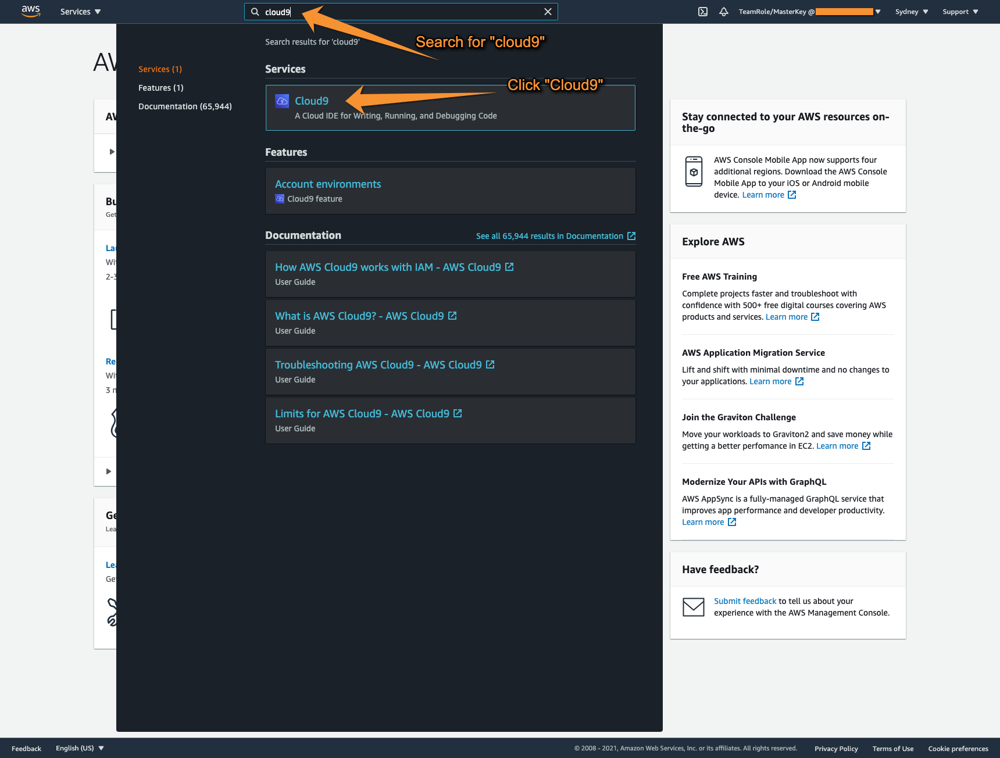

----

#### Create Cloud9 environment

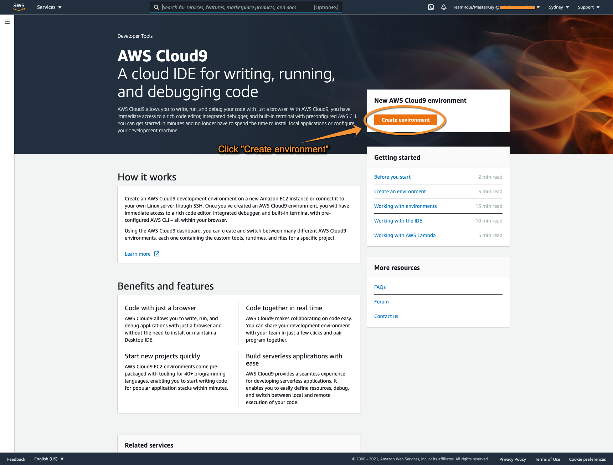

----

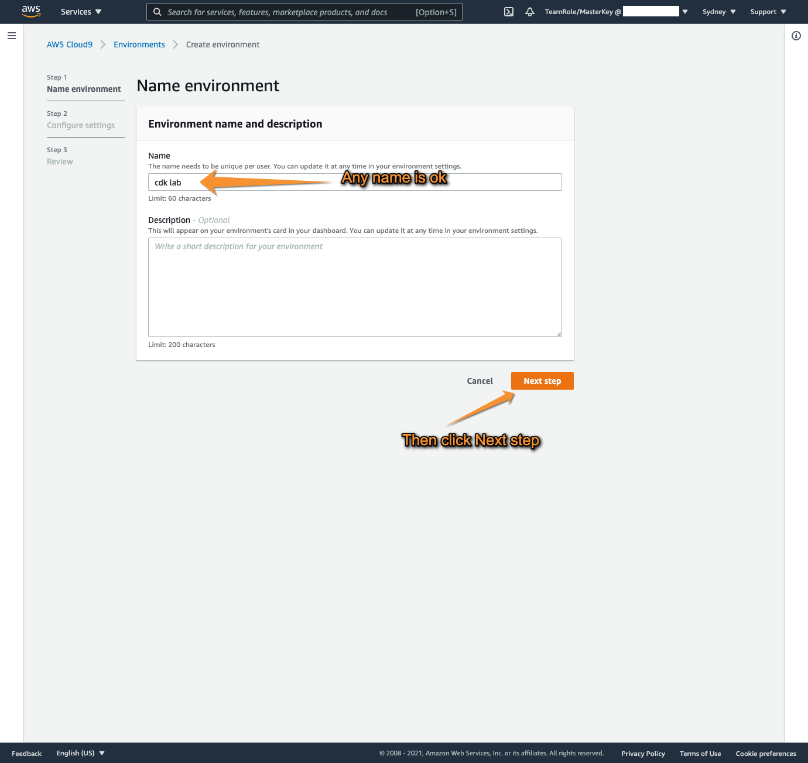

----

#### Configure your Cloud9 environment

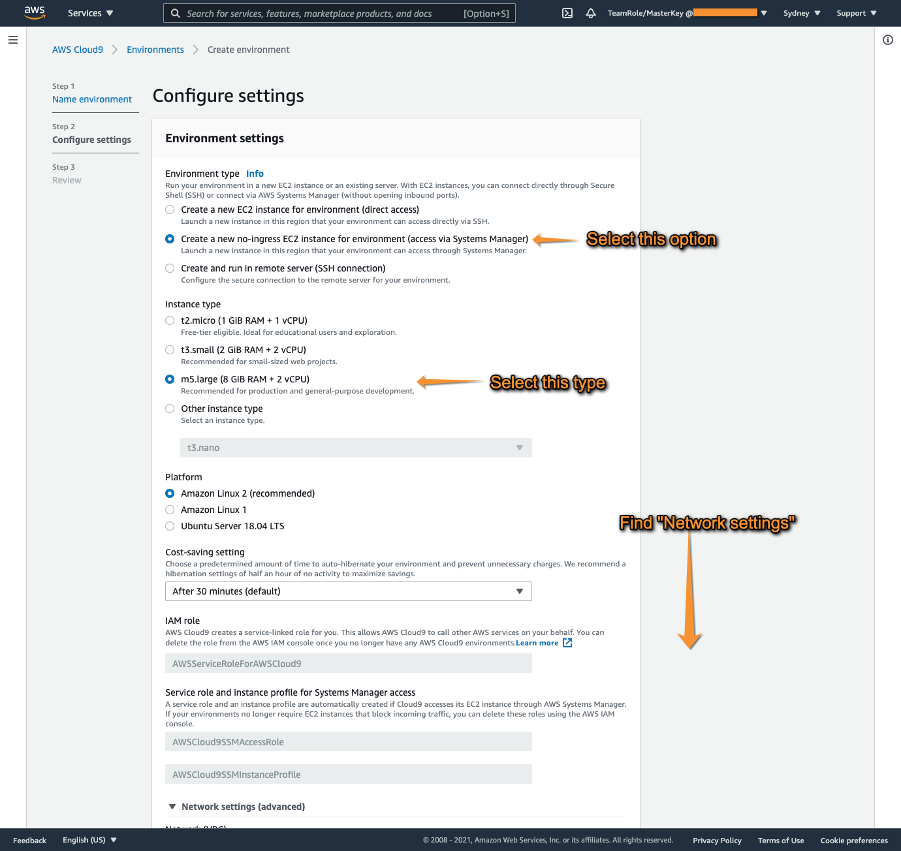

----

#### Select **Network (VPC)** from **Network settings**

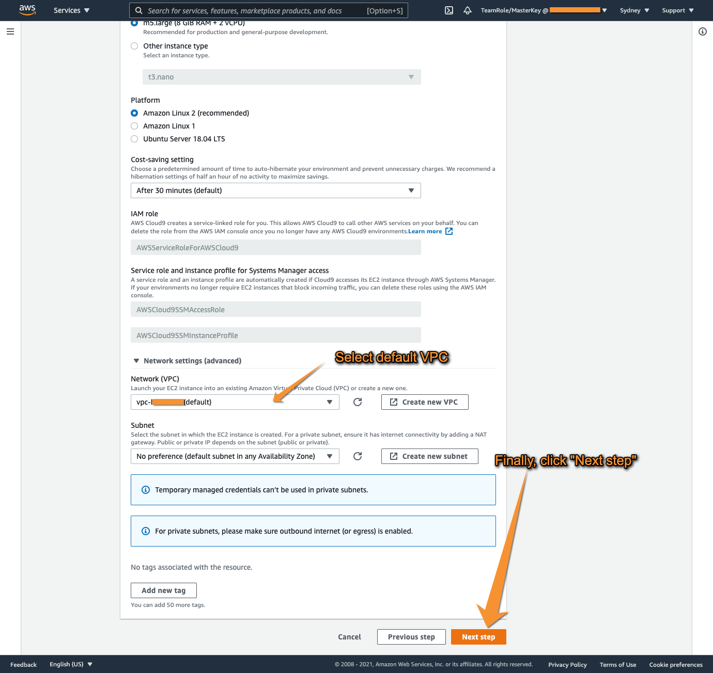

----

#### Review and create

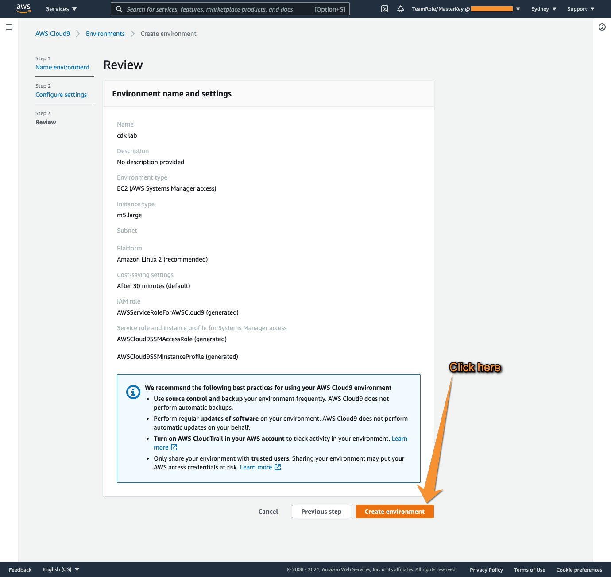

----

#### Wait for IDE to be ready

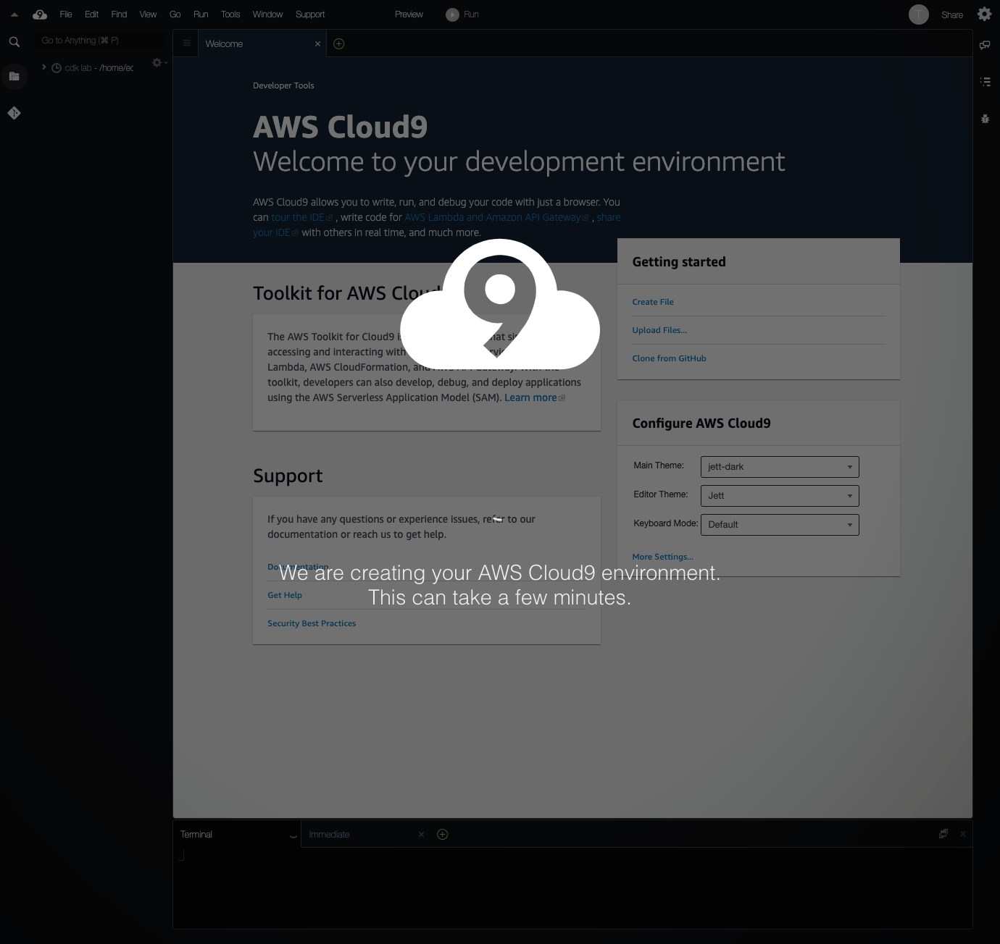

----

{}
If you see this Error message, click `OK` to proceed 
{}

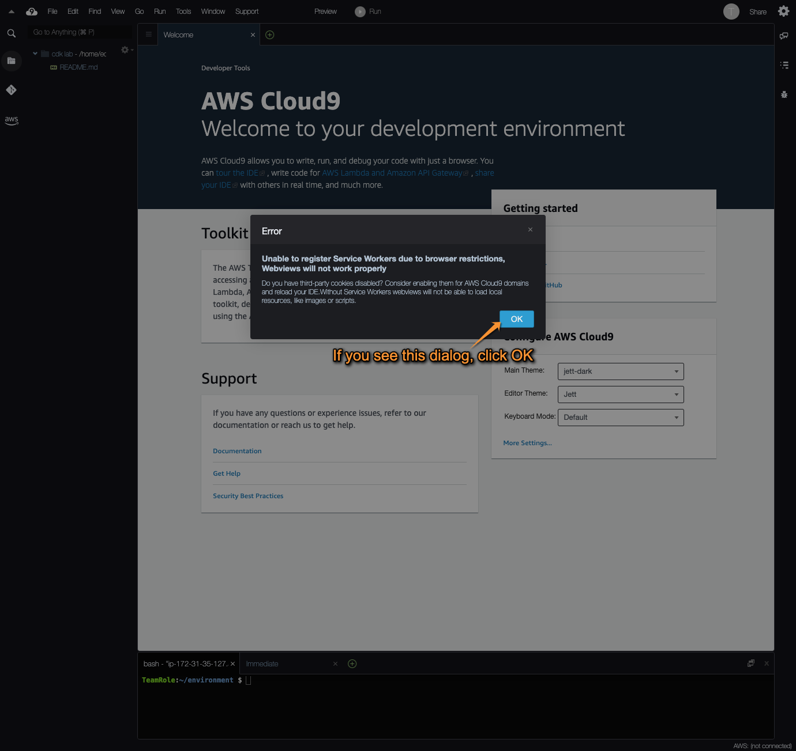

----

From a terminal window, run:

```
aws sts get-caller-identity
```

Verify if `assumed role` shows as below

```
arn:aws:sts::YOUR_AWS_ACCOUNT_ID:assumed-role/TeamRole/MasterKey
```


To check CDK version, run:

```
cdk --version
```

Verify if version is `1.110.` or **higher**

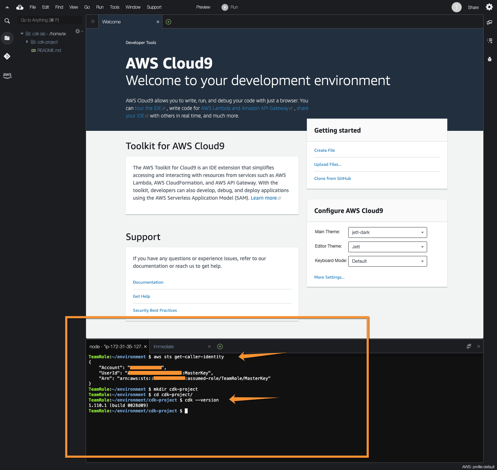

## Now let's upgrade CDK to its latest version

```
npm install -g aws-cdk --force
```

----


#### Troubleshooting

{}
If you get logged out of AWS Console, try following steps to obtain new `temporary credentials`
{}

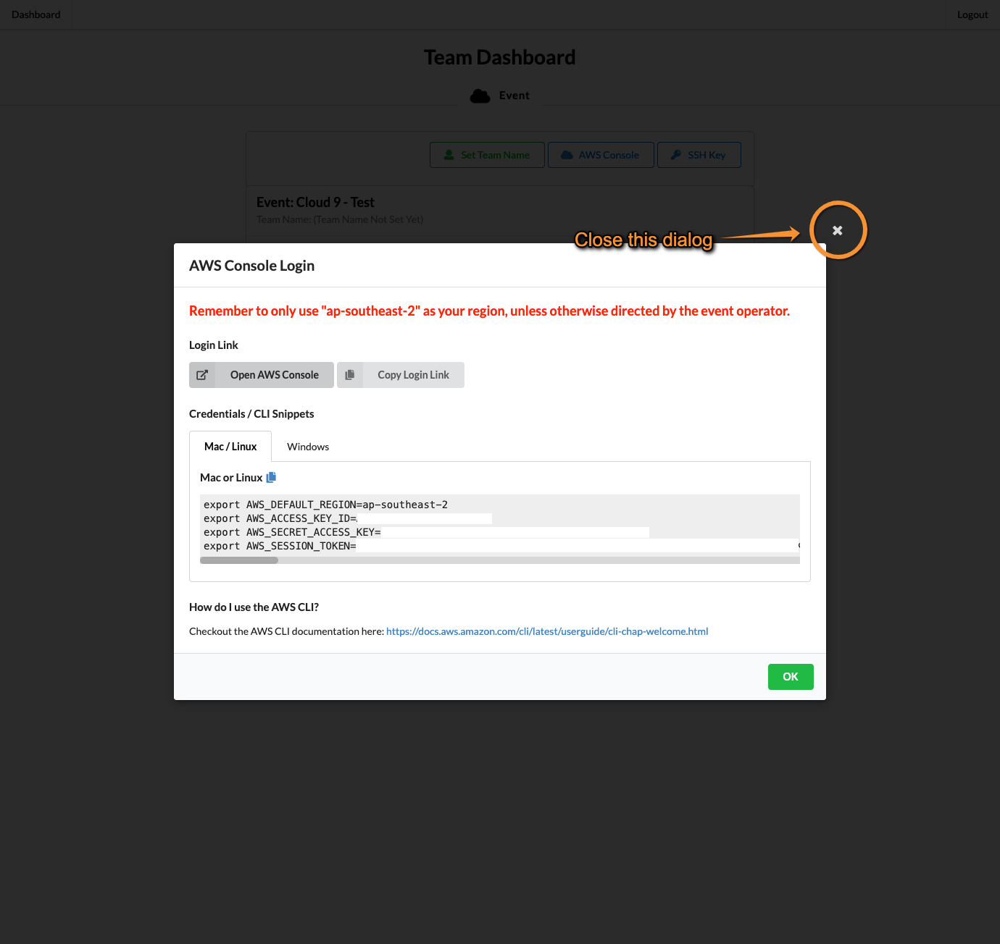

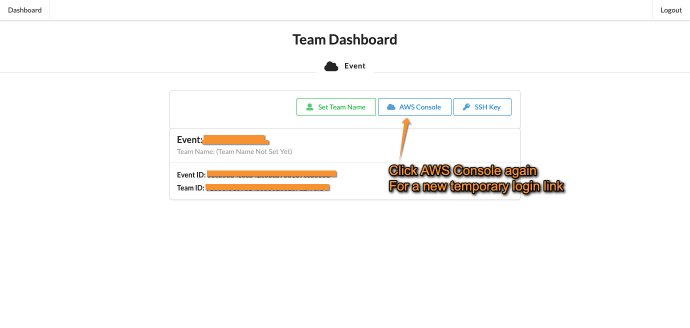

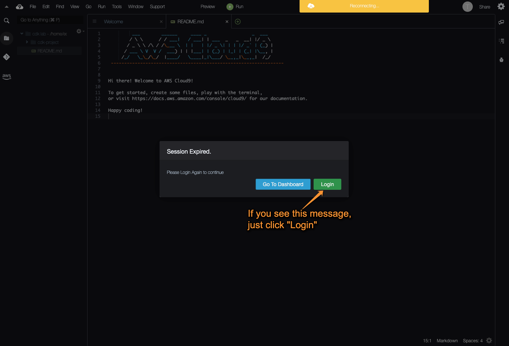